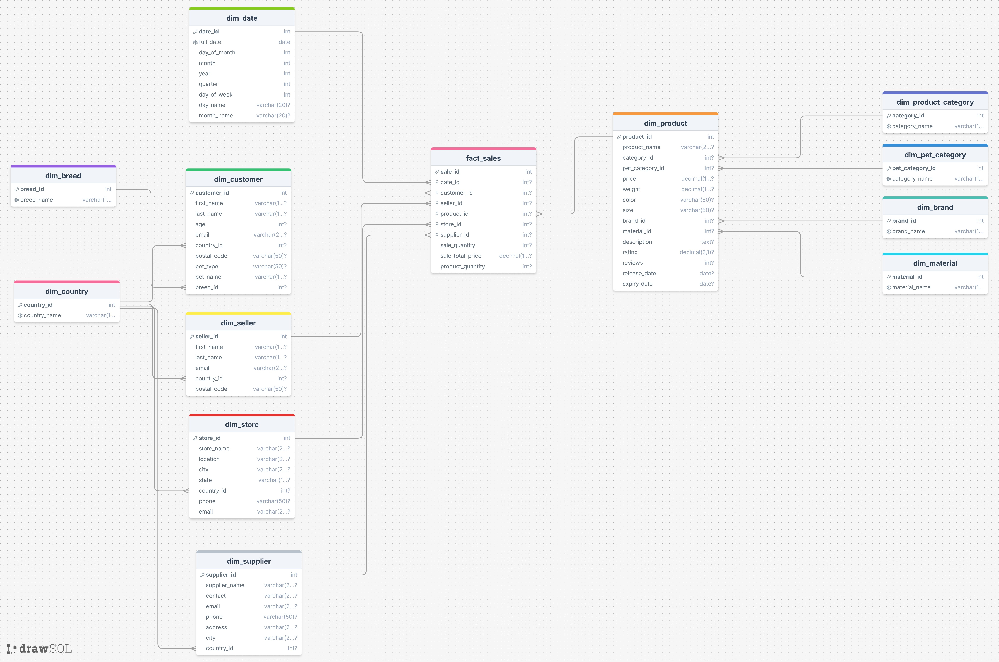

# BigDataSnowflake
#### Выполнил Бугренков Владимир М8О-311Б-23

### Схема снежинки


### что сделано
нужные sql-скрипты сделаны(инициализация мок данными, заполнение мок-таблицы из csv, ddl скрипт для создание снежинки и dml для ее заполнения), модель снежинки построена, бд запускается в контейнере


### инструкция по запуску
1. git clone
```bash
   git clone <URL_REPO>
   cd BDSnowflake
```

можно настроить .env, если хочется;
значения по дефолту без .env такие:
POSTGRES_USER=postgres
POSTGRES_PASSWORD=postgres
POSTGRES_DB=postgres
POSTGRES_PORT=5432

2. compose up
```bash
docker compose up -d
```
3. Проверка логов инициализации спустя пару секунд
```bash
docker compose logs postgres
```

ожидается:

```text
petshop_postgres  |                     info                    
petshop_postgres  | --------------------------------------------
petshop_postgres  |  Проверка на легит: колво строк по таблицам
petshop_postgres  | (1 row)
petshop_postgres  | 
petshop_postgres  |       table_name      | rows  
petshop_postgres  | ----------------------+-------
petshop_postgres  |  dim_material         |    11
petshop_postgres  |  dim_brand            |   383
petshop_postgres  |  dim_pet_category     |     5
petshop_postgres  |  dim_product_category |     3
petshop_postgres  |  dim_breed            |     3
petshop_postgres  |  dim_country          |   230
petshop_postgres  |  dim_date             |   364
petshop_postgres  |  dim_seller           | 10000
petshop_postgres  |  dim_store            | 10000
petshop_postgres  |  dim_customer         | 10000
petshop_postgres  |  dim_supplier         | 10000
petshop_postgres  |  fact_sales           | 10000
petshop_postgres  |  dim_product          | 10000
petshop_postgres  |  mock_data (staging)  | 10000
petshop_postgres  | (14 rows)

что-то там

petshop_postgres  | 2026-03-18 17:19:24.203 UTC [1] LOG:  database system is ready to accept connections
```

4. готовые запросы для проверки через CLI
подрубаемся:
```bash
PGPASSWORD=postgres psql -h localhost -p 5432 -U postgres -d petshop
```
4.1. 
```psql
SELECT 'mock_data' AS table_name, COUNT(*) AS rows FROM mock_data UNION ALL
SELECT 'dim_customer', COUNT(*) FROM dim_customer UNION ALL
SELECT 'dim_product', COUNT(*) FROM dim_product UNION ALL
SELECT 'fact_sales', COUNT(*) FROM fact_sales;
```

4.2. 
```psql
SELECT c.first_name, p.product_name, d.full_date, f.sale_total_price
FROM fact_sales f
JOIN dim_customer c ON f.customer_id = c.customer_id
JOIN dim_product p ON f.product_id = p.product_id
JOIN dim_date d ON f.date_id = d.date_id
LIMIT 5;
```


